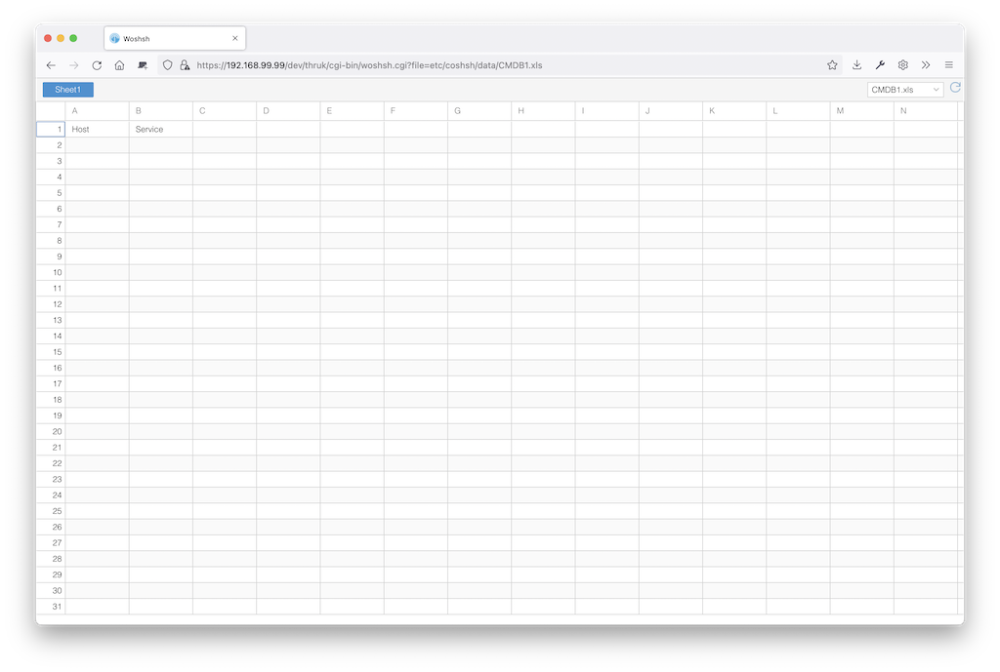

## Woshsh Thruk Plugin

This plugin allows you to edit excel files.

## Installation

Assuming you are using OMD (omdistro.org).
All steps have to be done as site user:

    %> cd etc/thruk/plugins-enabled/
    %> git clone https://github.com/sni/thruk-plugin-woshsh.git woshsh
    %> omd reload apache

You now have a new menu item under System -> Woshsh.

In order to edit excel files, you have to define which files to edit. Create a
new file:

`~/etc/thruk/thruk_local.d/woshsh.conf`.

For example:

    <Component Thruk::Plugin::woshsh>
        input_file       = etc/coshsh/data/CMDB1.xls
        input_file       = etc/coshsh/data/CMDB2.xls
    </Component>

You have to reload the apache to activate changes
from the `thruk_local.conf`.

The plugin has no permission handling itself, but you could wrap the
configuration into Group tags like:

    <Group Admins>
      <Component Thruk::Plugin::woshsh>
        input_file       = etc/coshsh/data/CMDB1.xls
      </Component>
    </Group>
